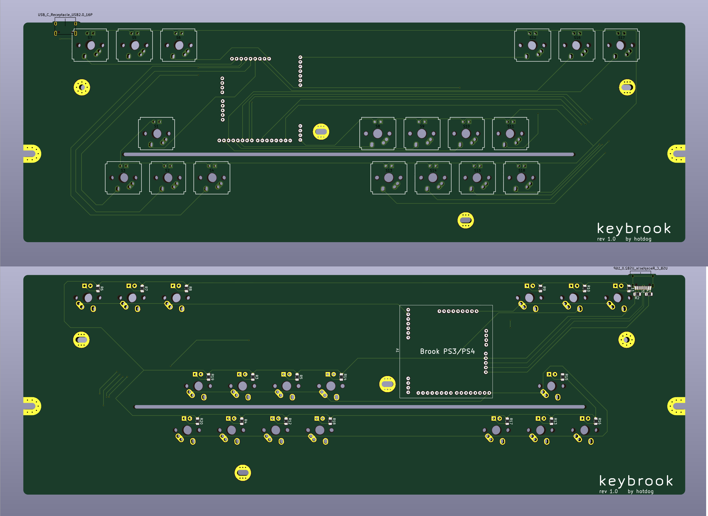
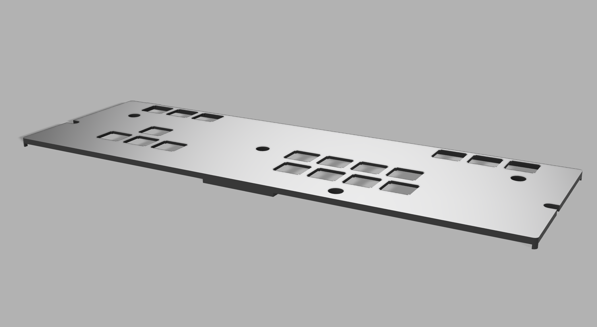
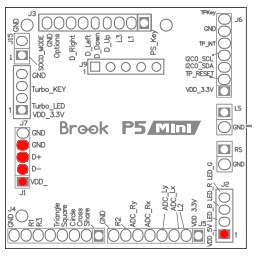
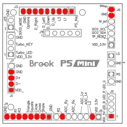

# Keybrook
> Most of the keys are gone!? The hitbox for keyboard warriors.

A hitbox in the form factor of a 60% keyboard. Compatible with the Brook P3/P4 Mini and Brook P5 Mini. Small form factor, USB-C and fits with 60% keyboard carry cases for easy transport. Change the keycaps and cases to further customise your hitbox.

| Renders |
| :-----------:|
| PCB |
|  |
| 3D Printed Faceplate |
|  |
## Parts List
- Brook P3/P4 Mini or Brook P5 Mini
- Resin 3D Printed Faceplate
- 18 1.8mm White LEDs
- 18 Key Switches
- GH60 Compatible PC Case (Modifications might be needed)
- 40 Break Away 2.0mm Pitch Board to Board Pins
- Keycaps for F1 - F6 or F1 - F3, F10 - F12
- Keycaps for WASD
- Keycaps for JUIKOLP;

## Assembly
### _Step 1 (Optional)
Apply vinyl wrap to the faceplate.
### _Step 2_
Modify case to allow the PCB to sit flush.

### _Step 3_
Solder the board to board pins into the backside of the PCB.

### _Step 4_
Solder the LEDs into the frontside of the PCB, the circular pads are positive.

### _Step 5_
Put on Brook P5 Mini and solder LED pins and USB pins. 

See Image

### _Step 6_ 
Plug it in to check all LEDS work. 

### _Step 7_
Solder the following pins.

See Image 

### _Step 8_
With the faceplate in place; solder F1, F6, A, ; switches.

### _Step 9_ 
Solder rest of keyswitches.

### _Step 10_ 
Put the case and keycaps on.

> **Done!**  
## Special Thanks
- [ai03-2725 / Voyager60](https://github.com/ai03-2725/Voyager60)
- [Breadcrumbsflatbox / hardware-rev3](https://github.com/jfedor2/flatbox/tree/master/hardware-rev3)
